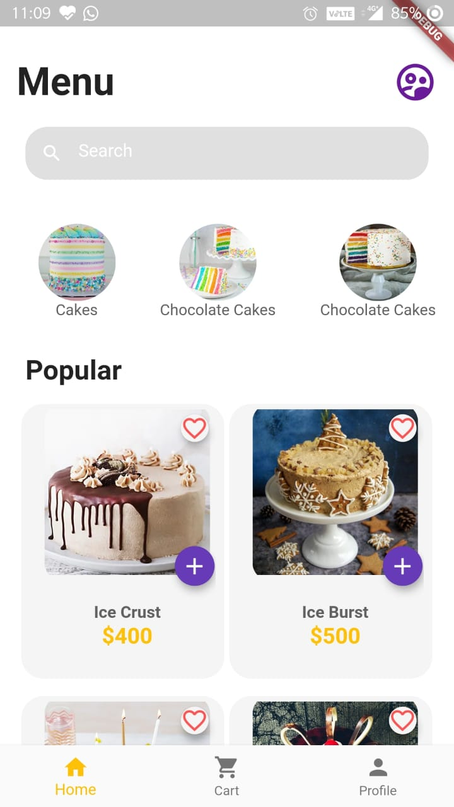
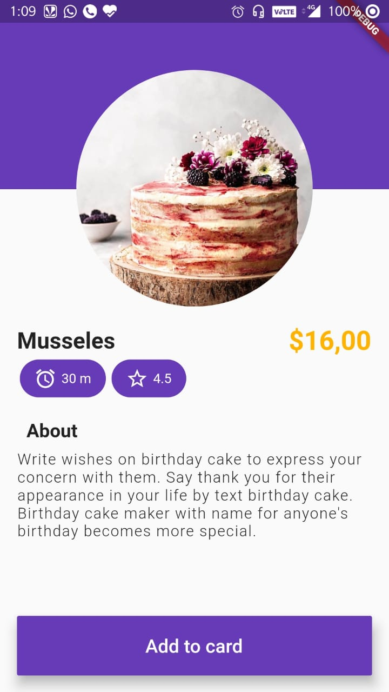
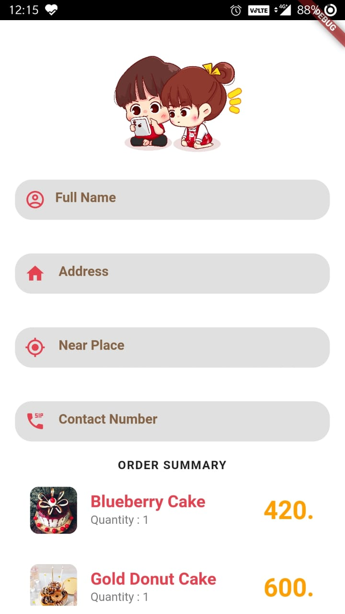
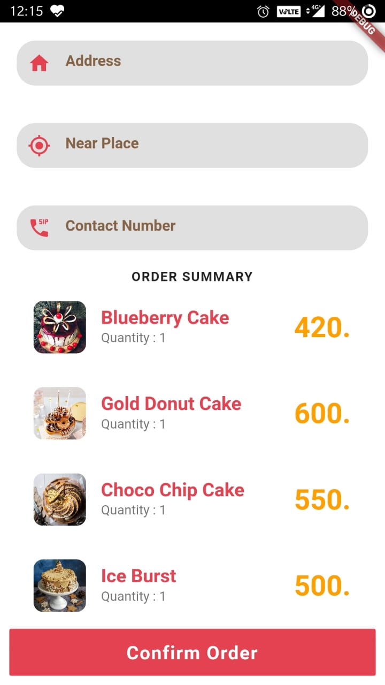

# PieBar 

A food Ordering Application based on Flutter. Completely Api based. 

### Features
- Browse All cakes/cusines available by the Seller/Owner.
- Add to the cart with number of items to be bought.
- Add details of the user - place the order :).

### Library / Dependencies 
- Material
- FutureBuilder
- http
- Classes/ListBuilder/MaterialButton/Navigator

### UI
     
     
   

